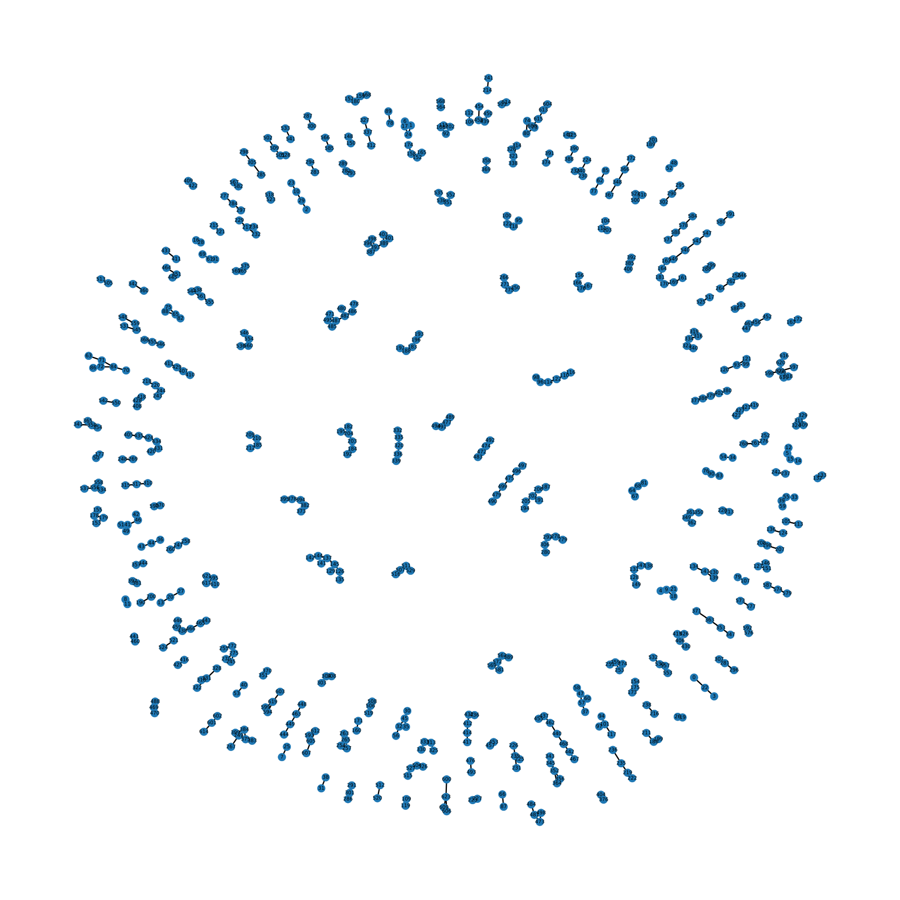
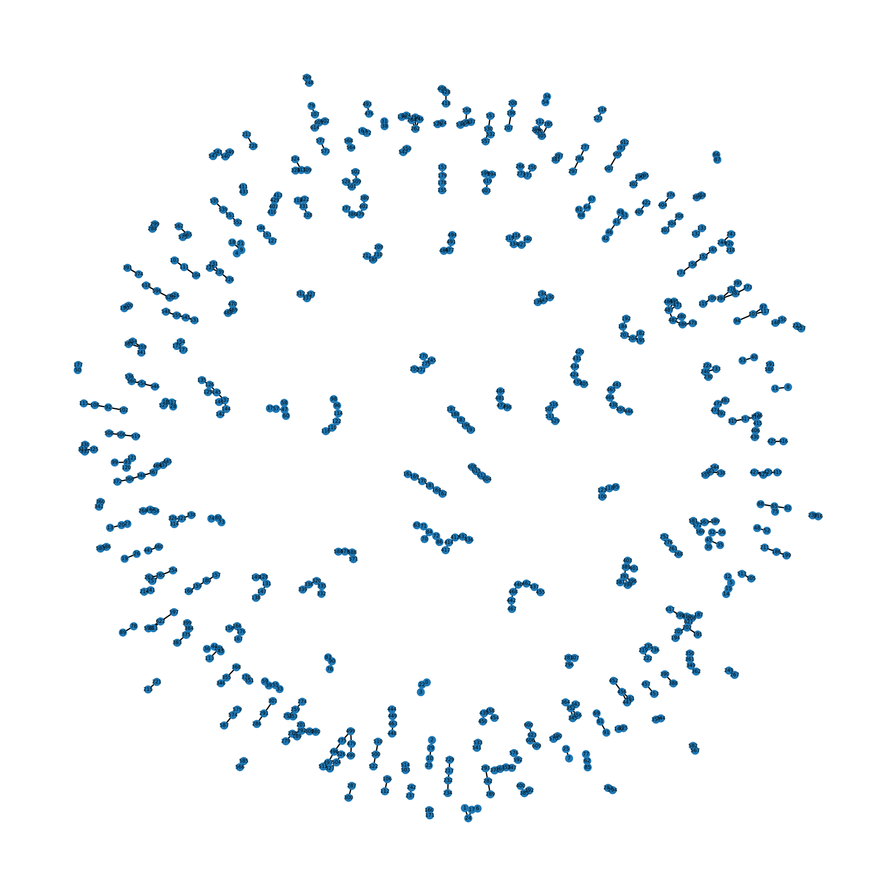
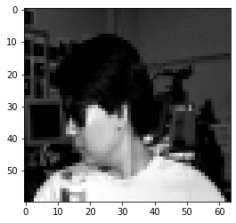
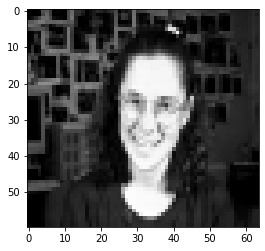
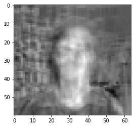
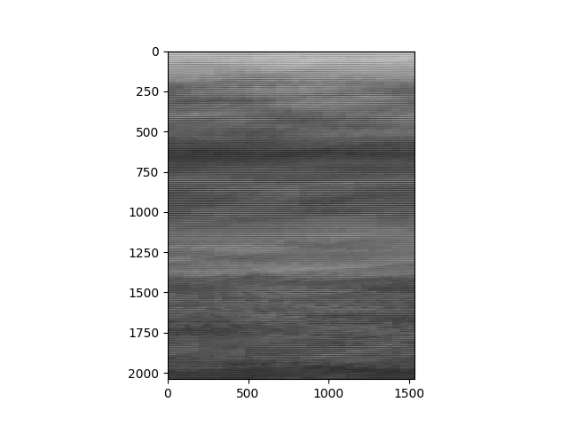
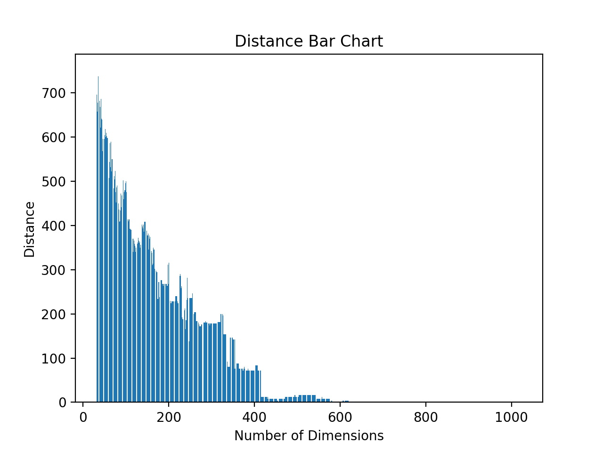

Full Graph

PCA Grahph

Len of Both pairs:  529

Length of fullOnly Pairs:  95

Length of fullOnly Pairs:  95

Image 1:

Projected Image:

Image 2:

Projected Image:

Original Gray Scale Image:

Mini-Image reconstruction with 32 principal components:

Mini-Image reconstruction with 4 principal components:

Bar Chart

